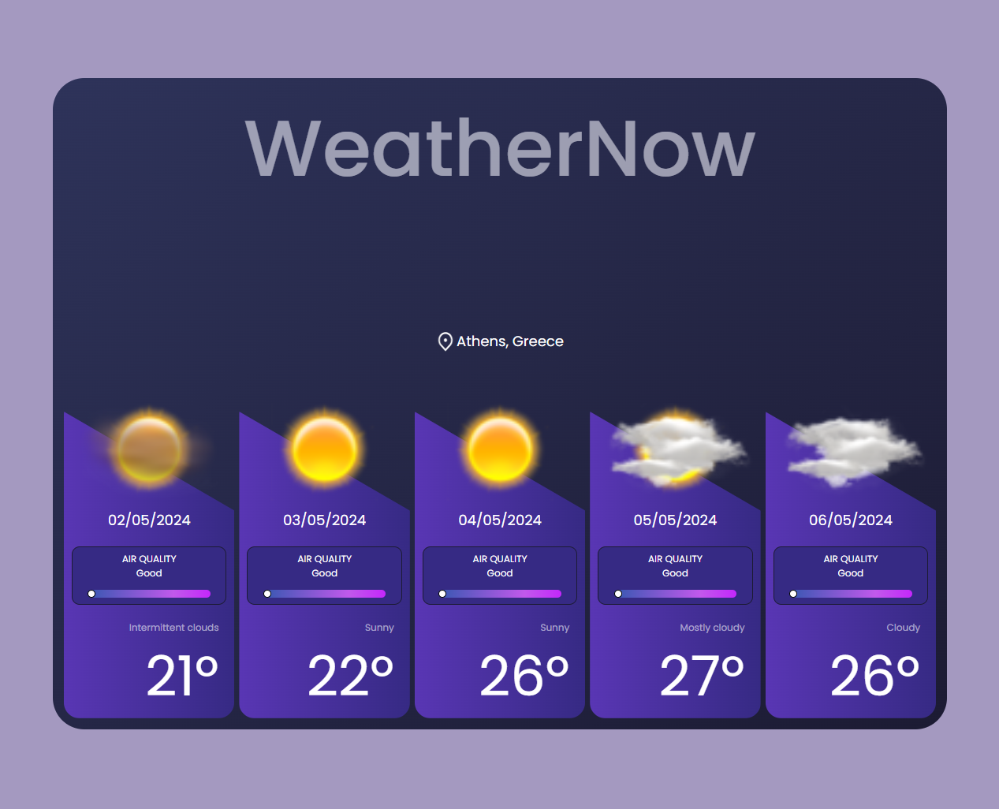
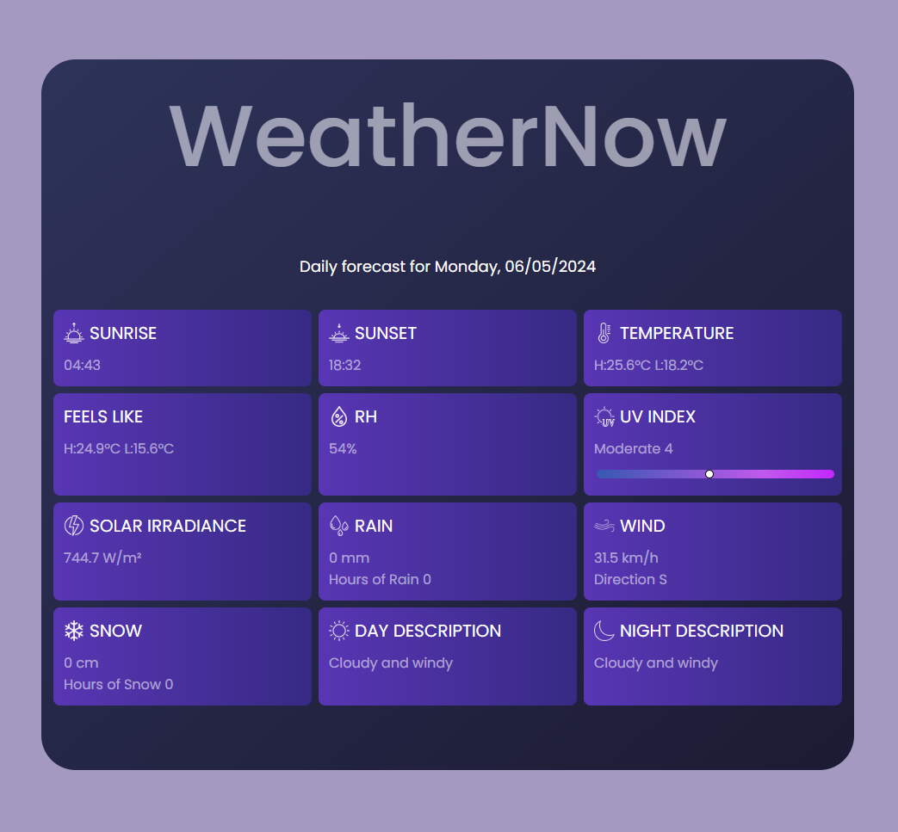
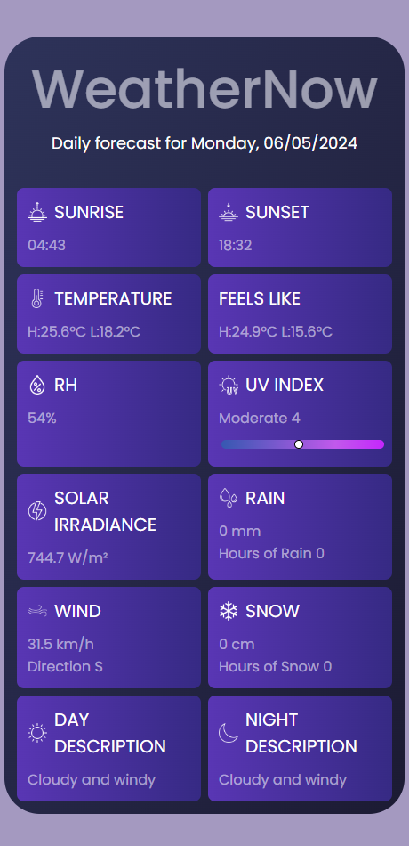

# WeatherNOW - React Weather App

A real-time weather web app created with React.js, Typescript and styled components. Users can search the weather forecast for any city in the world by using the autocomplete search engine. A 5 days weather forecast will be provided for the user with detailed informations about every day. Weather data is fetched from an AccuWeather API.

     

## Features

▪️ **Current Weather Conditions**: Displays current weather conditions such as temperature, relative humidity, rain, UV index, and more.

▪️ **5-day forecast**: Provides weather infomation for 5 days.

▪️ **Search Autocomplete**: Returns basic information about locations matching an autocomplete of the search text.

     

## Technical overview

▪️ React js

▪️ Typescript

▪️ Styled components

     

